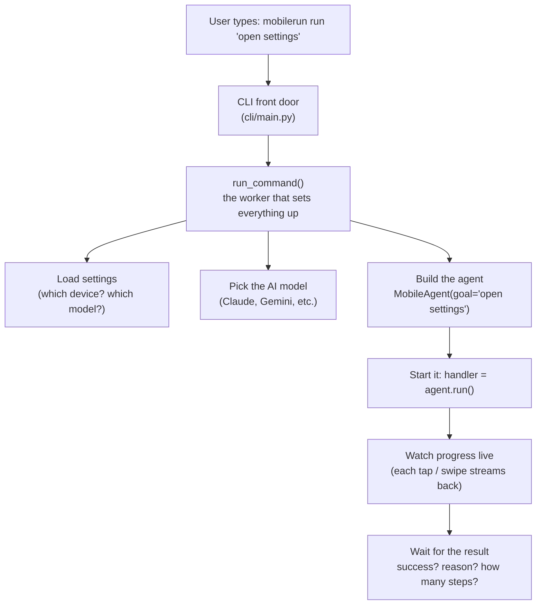
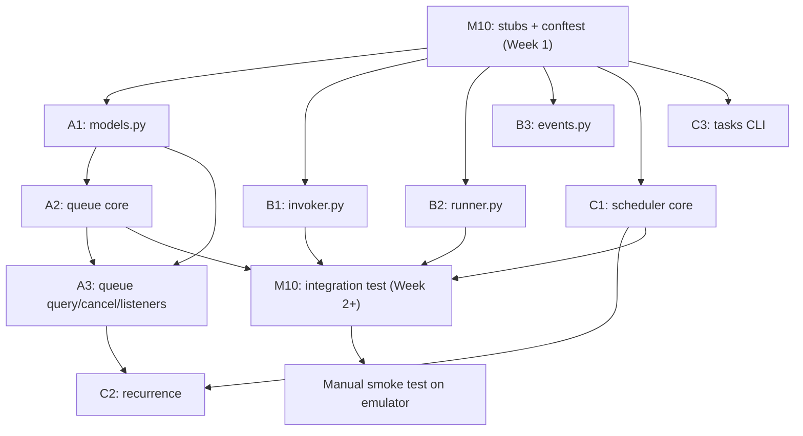

# mobilerun Orchestration Layer — Team Plan

**Team size:** 10 members · **Target:** upstream contribution to [`droidrun/mobilerun`](https://github.com/droidrun/mobilerun) · **Package:** `mobilerun` v0.6.6

---

## Context

mobilerun runs **exactly one task per agent instance**: the CLI builds one `MobileAgent`, awaits its result, and exits. Our contribution is an **orchestration layer above the existing agent runtime**. It:

- queues multiple `TaskRequest`s
- runs them **one at a time** through the existing `MobileAgent`
- tracks status (`waiting → running → completed/failed`)
- schedules **when** they run

> We do **not** touch or duplicate the Manager / Executor / FastAgent reasoning machinery. We sit on top of it.

### Decisions already locked with the team lead

| Decision | Choice | Note |
|---|---|---|
| Queue storage | **In-memory only** (MVP) | Even though the MVP stores tasks in memory (a plain Python list/dict that vanishes when the process exits), the design for `TaskQueue` should be swappable if later need to persist tasks in db |
| Scheduling | **Stdlib-only** (built-in python libraries) | we can have schedulers running at certain time (e.g. 9:00 PM tonight) with `run-at-datetime` and we can have recurring fixed run (e.g. run this task every 30min) with `repeat-every-interval` |
| CLI | **`mobilerun tasks` subcommand group** | We add new commands family: `mobilerun tasks submit`, `mobilerun tasks list`, `mobilerun tasks status`, `mobilerun tasks cancel`, etc. It follows the same click CLI pattern the repo already uses, and keeps the multi-task orchestrator cleanly separate from the existing single-task mobilerun run |
| Dependencies | **No new runtime deps** | Keeps the upstream PR clean and mergeable |

---

## Current Codebase Map

Before the team builds anything, we need to know *exactly how mobilerun runs a single task today*, because the orchestrator has to call that same machinery. The diagram traces what happens when someone types `mobilerun run "open settings"`:



### The public interface our orchestrator calls

**`MobileAgent`** — `mobilerun/agent/droid/droid_agent.py:165` (a llama-index `Workflow`; legacy alias `DroidAgent = MobileAgent` at line 1065).

Constructor (lines 191–206):

```python
MobileAgent(goal: str, config: MobileConfig | None = None,
            llms: dict[str, LLM] | LLM | None = None, custom_tools: dict = None,
            credentials=None, variables: dict | None = None,
            output_model: Type[BaseModel] | None = None, prompts=None,
            driver=None, state_provider=None, timeout: int = 1000, **kwargs)
```

Run (line 398) — **not** `async def`; returns an awaitable workflow handler:

```python
def run(self, *args, **kwargs) -> Awaitable[ResultEvent] | WorkflowHandler
```

**Usage contract:** `handler = agent.run()` → optionally iterate `handler.stream_events()` → `result = await handler`.

Result type — **`ResultEvent`**, `mobilerun/agent/droid/events.py:94` (pydantic `StopEvent`):

```python
class ResultEvent(StopEvent):
    success: bool
    reason: str
    steps: int
    structured_output: Optional[BaseModel] = None
```

### What we must NOT touch

`MobileAgent` has a whole reasoning engine inside it (planning, deciding actions, talking to the phone). **We never open that up.** We only build `MobileAgent` from the outside and call `.run()`. Off-limits:

- `ManagerAgent` / `StatelessManagerAgent` — `mobilerun/agent/manager/`
- `ExecutorAgent` — `mobilerun/agent/executor/executor_agent.py`
- `FastAgent` (direct mode) — `mobilerun/agent/fast_agent/fast_agent.py`
- `MobileAgent.start_handler` wires drivers, tool registry, and `ActionContext` itself — we never build those; we only **construct `MobileAgent` per task**.

### Where our new code goes

Everything new lives in **one new folder + one new CLI file** — we add code, we don't edit theirs (except a 2-line CLI registration):

- `mobilerun/orchestration/` — all our orchestrator code
- `mobilerun/cli/task_commands.py` — our new `tasks` command

### How we test (no real phone needed)

- Tests live flat in `tests/`, run with `pytest`.
- **Copy this file's pattern:** `tests/test_vision_only_run_cli.py`. It swaps the real `MobileAgent` for a **fake** one, so tests run fast with no device and no API keys. Our runner talks to the same fake.

---

## Step 0 — Team-Wide Design Contract (sign-off before anyone codes)

### 0.1 Shared data model — `mobilerun/orchestration/models.py` (owned by A1)

```python
class TaskStatus(str, Enum):
    WAITING   = "waiting"
    RUNNING   = "running"
    COMPLETED = "completed"
    FAILED    = "failed"
    CANCELLED = "cancelled"


@dataclass
class TaskRequest:
    goal: str                                   # natural-language command (maps to MobileAgent(goal=...))
    id: str = field(default_factory=lambda: uuid.uuid4().hex)
    created_at: datetime = field(default_factory=datetime.now)
    scheduled_at: datetime | None = None        # None = run ASAP
    repeat_every: timedelta | None = None       # recurring interval (C2); None = one-shot
    priority: int = 0                           # higher runs first among ready tasks
    device_serial: str | None = None            # overrides config.device.serial
    llm_provider: str | None = None             # optional per-task load_llm override
    llm_model: str | None = None
    config_path: str | None = None              # per-task ConfigLoader.load path
    timeout: int = 1000                         # passed to MobileAgent
    metadata: dict = field(default_factory=dict)


@dataclass
class TaskResult:                               # flattened from ResultEvent
    task_id: str
    success: bool
    reason: str
    steps: int
    structured_output: Any | None = None
    error: str | None = None                    # exception text if the run raised
    started_at: datetime | None = None
    finished_at: datetime | None = None


@dataclass
class TaskRecord:                               # what the queue stores & returns on queries
    request: TaskRequest
    status: TaskStatus = TaskStatus.WAITING
    result: TaskResult | None = None
```

### 0.2 Interface contracts between A, B, C

**A exposes `TaskQueue`** — `mobilerun/orchestration/queue.py`:

```python
class TaskQueue:
    def submit(self, request: TaskRequest) -> str            # returns task id; status=WAITING
    async def dequeue(self) -> TaskRequest                   # blocks (asyncio.Condition) until a task
                                                             # is READY: scheduled_at is None or <= now;
                                                             # order: priority desc, then created_at asc (FIFO)
    def mark_running(self, task_id: str) -> None
    def mark_completed(self, task_id: str, result: TaskResult) -> None
    def mark_failed(self, task_id: str, result: TaskResult) -> None
    def cancel(self, task_id: str) -> bool                   # only WAITING tasks; True if cancelled
    def get(self, task_id: str) -> TaskRecord | None
    def list(self, status: TaskStatus | None = None) -> list[TaskRecord]
    def add_listener(self, cb: Callable[[TaskRecord], None]) -> None   # fired on every status change
    def wake(self) -> None                                   # re-evaluate readiness (scheduler calls when a timer fires)
```

> Invalid transitions (e.g. `mark_completed` on a `WAITING` task) raise `InvalidTransitionError` (defined in `models.py`).

**B exposes `AgentInvoker` + `TaskRunner`** — `mobilerun/orchestration/invoker.py`, `runner.py`:

```python
class AgentInvoker(Protocol):                                # THE integration seam — A and C mock exactly this
    async def run_task(self, request: TaskRequest,
                       event_callback: Callable[[Any], None] | None = None) -> TaskResult


class MobileAgentInvoker:                                    # default impl wrapping the existing agent
    def __init__(self, config: MobileConfig | None = None): ...
    async def run_task(self, request, event_callback=None) -> TaskResult


class TaskRunner:
    def __init__(self, queue: TaskQueue, invoker: AgentInvoker,
                 event_callback: Callable[[Any], None] | None = None): ...
    async def run_once(self) -> TaskResult                   # dequeue → mark_running → invoke → mark_completed/failed
    async def run_forever(self) -> None                      # loop run_once; sequential by construction (one loop, one agent at a time)
    def stop(self) -> None                                   # finish current task, then exit loop
```

**C exposes `Scheduler`** — `mobilerun/orchestration/scheduler.py`:

```python
class Scheduler:
    def __init__(self, queue: TaskQueue): ...
    def schedule(self, request: TaskRequest) -> str          # submit + arm an asyncio timer for scheduled_at
    async def start(self) -> None                            # timer loop; calls queue.wake() when tasks become ready;
                                                             # re-submits a clone when repeat_every is set
    def stop(self) -> None
```

> Stretch: `mobilerun/orchestration/triggers.py` — `Trigger` protocol + `on_event(name)` → submits a bound `TaskRequest`.

### 0.3 The one integration seam (Subtask B → existing agent)

`MobileAgentInvoker.run_task` is the **only** place orchestration touches mobilerun internals. It mirrors `run_command` in `cli/main.py`:

```python
async def run_task(self, request, event_callback=None) -> TaskResult:
    config = self._config or ConfigLoader.load(request.config_path)
    if request.device_serial:
        config.device.serial = request.device_serial
    llms = load_llm(request.llm_provider, model=request.llm_model) if request.llm_provider else None
    agent = MobileAgent(goal=request.goal, config=config, llms=llms, timeout=request.timeout)
    handler = agent.run()
    async for event in handler.stream_events():
        if event_callback:
            event_callback(event)
    try:
        result: ResultEvent = await handler
        return TaskResult(task_id=request.id, success=result.success, reason=result.reason,
                          steps=result.steps, structured_output=result.structured_output, ...)
    except Exception as e:
        return TaskResult(task_id=request.id, success=False, reason="agent raised",
                          steps=0, error=str(e), ...)
```

> A and C **never import `MobileAgent`**; they mock `AgentInvoker.run_task` (shared `FakeInvoker` in `conftest`).

### 0.4 Module / file layout

```
mobilerun/orchestration/
    __init__.py        # exports: TaskRequest, TaskStatus, TaskResult, TaskRecord,
                       #          TaskQueue, TaskRunner, AgentInvoker, MobileAgentInvoker, Scheduler
    models.py          # A1
    queue.py           # A2 (+A3 query/cancel/listeners)
    invoker.py         # B1
    runner.py          # B2
    events.py          # B3 (orchestration-level events: TaskStarted/TaskFinished, log bridge)
    scheduler.py       # C1 (+C2 recurrence)
    triggers.py        # C3 (stretch)
mobilerun/cli/task_commands.py    # C3: click group `tasks`, registered in cli/main.py
mobilerun/__init__.py             # M10: re-export orchestration public names
tests/                            # flat, matching repo convention
    conftest.py                       # M10: FakeInvoker, FakeAgent/FakeHandler, sample requests
    test_task_models.py               # A1
    test_task_queue.py                # A2
    test_task_queue_api.py            # A3
    test_agent_invoker.py             # B1
    test_task_runner.py               # B2
    test_task_events.py               # B3
    test_scheduler.py                 # C1/C2
    test_task_cli.py                  # C3 (CliRunner pattern from test_vision_only_run_cli.py)
    test_orchestration_integration.py # M10: queue→scheduler→runner end-to-end with FakeInvoker
```

### 0.5 Naming & conventions

- Classes `TaskQueue`-style PascalCase; modules short lowercase (matches repo).
- Async where the existing runtime is async (`dequeue`, `run_task`, `run_once`, `start`); pure state methods stay sync.
- Tests: pytest-native style (like `tests/test_llm_picker.py`) for new code; `CliRunner` + `unittest.mock` for CLI.
- Commits: conventional commits, scope `orchestration` (e.g. `feat(orchestration): add TaskQueue ordering`); branches `feat/orchestration-<chunk>`.
- No new runtime dependencies (stdlib-only scheduling).

Runtime Example:


---

## Subtask A — Task model + queue (3 members)

**Files:** `orchestration/models.py`, `queue.py` · **Tests:** `test_task_models.py`, `test_task_queue.py`, `test_task_queue_api.py`

| Chunk | Owner | Scope | Inputs → Outputs | Tests owned |
|---|---|---|---|---|
| **A1** | Member 1 | `models.py`: `TaskStatus`, `TaskRequest`, `TaskResult`, `TaskRecord`, `InvalidTransitionError`, `to_dict`/`from_dict` helpers | Contract §0.1 → importable dataclasses everyone uses | `test_task_models.py`: defaults, id uniqueness, serialization round-trip, status enum values |
| **A2** | Member 2 | `queue.py` core: `submit`, `dequeue` (`asyncio.Condition` blocking, readiness = `scheduled_at is None or <= now`), ordering (priority desc → FIFO), `mark_running/completed/failed` with transition validation, `wake()` | A1 models → a working queue B can pull from | `test_task_queue.py`: FIFO & priority order, dequeue blocks then wakes on submit/wake, `scheduled_at` gating, illegal transitions raise |
| **A3** | Member 3 | Queue query/observability API on top of A2's class: `get`, `list(status=...)`, `cancel`, `add_listener` status-change callbacks (consumed by C3's live CLI table and C3 triggers) | A2 skeleton (stub signatures suffice to start) → inspection & cancellation surface | `test_task_queue_api.py`: list filtering, cancel only-`WAITING` semantics, listener fired once per transition |

**Build order:** A1 → (A2 ∥ A3 against stubs) → A3 merges onto A2's real class. **No dependency on B or C.**

---

## Subtask B — Runner + agent integration (3 members)

**Files:** `orchestration/invoker.py`, `runner.py`, `events.py` · **Tests:** `test_agent_invoker.py`, `test_task_runner.py`, `test_task_events.py`

> This is the **only** subtask that imports `MobileAgent`.

| Chunk | Owner | Scope | Inputs → Outputs | Tests owned |
|---|---|---|---|---|
| **B1** | Member 4 | `invoker.py`: `AgentInvoker` protocol + `MobileAgentInvoker` (§0.3): `ConfigLoader.load`, per-task `device_serial`/`load_llm` overrides, `MobileAgent` construction, `stream_events` forwarding, `ResultEvent → TaskResult` mapping, exception → failed `TaskResult` | `TaskRequest → TaskResult`; references `cli/main.py:run_command`, `droid_agent.py`, `loader.py`, `llm_picker.py` | `test_agent_invoker.py`: patch `mobilerun.orchestration.invoker.MobileAgent` with `FakeAgent/FakeHandler` (pattern from `test_vision_only_run_cli.py`); assert kwargs passed to agent, `ResultEvent` mapping, exception → `success=False, error=...` |
| **B2** | Member 5 | `runner.py`: `TaskRunner.run_once/run_forever/stop` — dequeue → `mark_running` → `invoker.run_task` → `mark_completed/mark_failed`; invoker exceptions never kill the loop; graceful stop after current task; guarantees sequential execution | A's `TaskQueue` + B1's protocol (mock both) → the loop that drives everything | `test_task_runner.py`: happy path status transitions, failing invoker → `FAILED` + loop continues, `stop()` drains current task |
| **B3** | Member 6 | `events.py`: orchestration events (`TaskStartedEvent`, `TaskFinishedEvent`) + bridge that adapts the agent's streamed events into per-task logging (reuse `cli/event_handler.py` `EventHandler` with a task-id prefix); wires `event_callback` from runner → invoker | Agent event stream → labeled console/log output for multi-task runs | `test_task_events.py`: callback receives forwarded events, task-id labeling, no crash when callback is `None` |

**Build order:** B1 ∥ B2 ∥ B3 immediately against stubs (B2 mocks `AgentInvoker`, B3 mocks the stream). Integration of the three happens in M10's harness.

---

## Subtask C — Scheduling + triggers + CLI (3 members)

**Files:** `orchestration/scheduler.py`, `triggers.py`, `cli/task_commands.py` (+ 2-line registration in `cli/main.py`) · **Tests:** `test_scheduler.py`, `test_task_cli.py`

| Chunk | Owner | Scope | Inputs → Outputs | Tests owned |
|---|---|---|---|---|
| **C1** | Member 7 | `scheduler.py`: `Scheduler.schedule/start/stop` — submits to queue, arms `asyncio` timers for `scheduled_at`, calls `queue.wake()` when a task becomes ready. Sequential execution itself is B2's single loop; C1 controls **when** tasks become eligible | `TaskRequest` with `scheduled_at` + A's queue (mocked) → tasks turn READY at the right time | `test_scheduler.py` (part): immediate tasks pass through, future task not dequeued early, wake fires at `scheduled_at` (short timedeltas, no sleeps > ~0.1s) |
| **C2** | Member 8 | Recurrence in `scheduler.py`: `repeat_every` → on-completion listener (A3's `add_listener`), clone request with next `scheduled_at` and resubmit. **Stretch:** cron expressions behind optional `croniter` import (documented as extras, not a hard dep) | C1 scheduler + A3 listeners → recurring tasks | `test_scheduler.py` (part): repeat task re-enqueued with advanced time, `stop()` halts recurrence, no duplicate clones |
| **C3** | Member 9 | `cli/task_commands.py`: click group `tasks` (registered on `cli` in `main.py`, same pattern as `device_commands.py`). **MVP (in-memory ⇒ single process):** `mobilerun tasks run "goal1" "goal2" --at ... --every ...` and `--file tasks.yaml` — builds queue+scheduler+runner in-process, live status via A3 listeners, exits with code 0 iff all succeeded. **Stretch:** `triggers.py` event triggers | All of A/B/C public classes (against stubs + `FakeInvoker`) → the user-facing entry point | `test_task_cli.py`: `CliRunner` invoking `tasks run` with `MobileAgentInvoker` patched to `FakeInvoker`; multi-goal ordering, `--file` parsing, exit codes |

**Build order:** C1 → C2 (same file — coordinate closely; C2 starts on recurrence design + tests while C1 lands). C3 is independent from day 1 against stubs.

---

## Dependency Graph / Build Order



---

## Verification

1. `pytest tests/` — all unit suites (models, queue, invoker, runner, scheduler, CLI) green; no device or API keys needed (agent always faked, per repo convention).
2. `tests/test_orchestration_integration.py` proves queue → scheduler → runner → status pipeline end-to-end with `FakeInvoker`.
3. **Manual smoke:** `mobilerun tasks run "open settings" "turn on dark mode"` on an emulator — verify sequential execution, live status table, exit code.
4. **Regression:** existing suite (esp. `tests/test_vision_only_run_cli.py`) still passes — we add code, never modify `agent/` internals; only `cli/main.py` gains a 2-line group registration.

---

## Quick Ownership Reference

| Member | Chunk | Deliverable |
|---|---|---|
| 1 | A1 | `models.py` — data model |
| 2 | A2 | `queue.py` — core queue |
| 3 | A3 | queue query/cancel/listeners |
| 4 | B1 | `invoker.py` — agent seam |
| 5 | B2 | `runner.py` — execution loop |
| 6 | B3 | `events.py` — event bridge |
| 7 | C1 | `scheduler.py` — timing |
| 8 | C2 | recurrence (+ cron stretch) |
| 9 | C3 | `tasks` CLI |
| 10 | — | stubs, conftest, integration, merge/PR |
